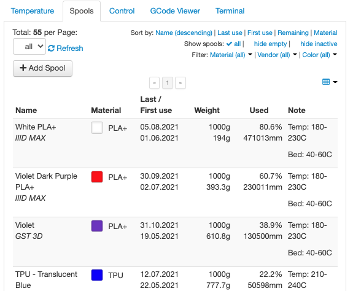
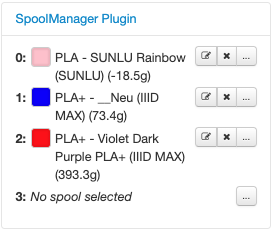
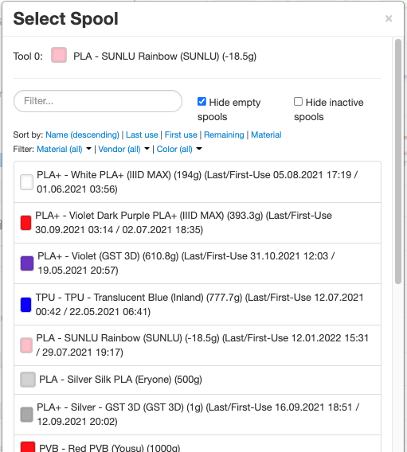
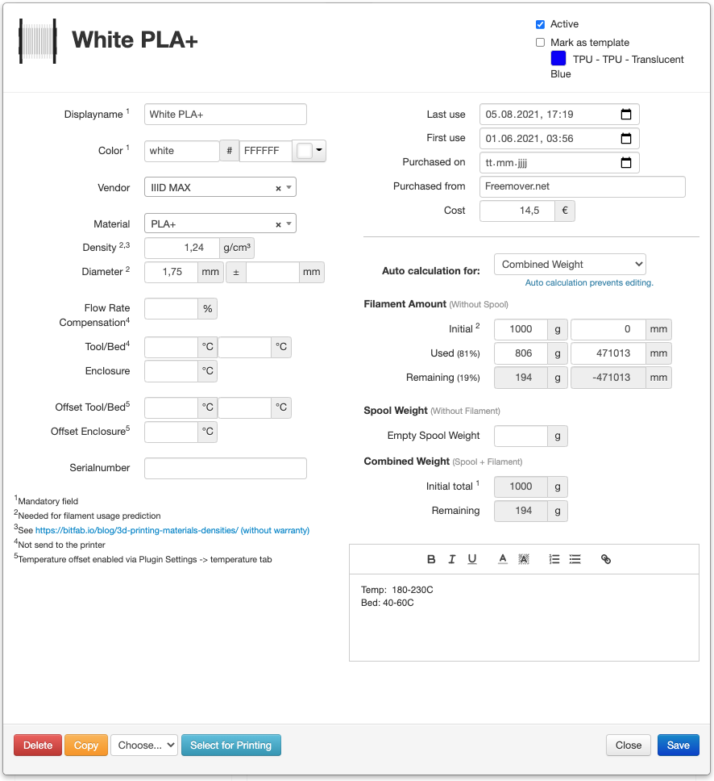
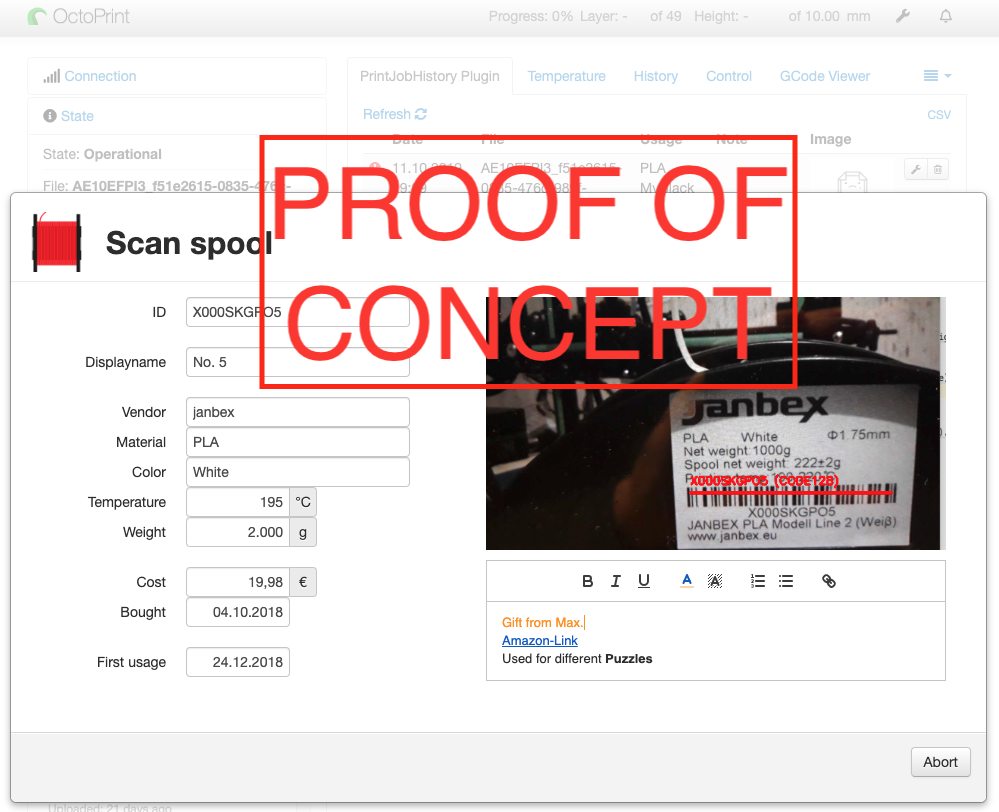
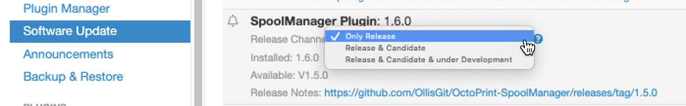

# OctoPrint-SpoolManager

[]()
[]()


The OctoPrint-Plugin manages all spool informations and stores it in a database.

#### Support my Efforts

This plugin, as well as my [other plugins](https://github.com/OllisGit/) were developed in my spare time.
If you like it, I would be thankful about a cup of coffee :)

[](https://www.paypal.com/cgi-bin/webscr?cmd=_s-xclick&hosted_button_id=6SW5R6ZUKLB5E&source=url)

## Tested with:
- OctoPrint 1.7.2:  with Python 3.7.3

## Included features

### Basic attributes to be captured:
- [X] Spool basic attributes, like name,  color, material, vendor ...
- [X] "Used length" and "Remaining weight"
- [X] Additional notes
- [X] CSV Export of "Legacy FilamentManager-Database" and SpoolManager
- [X] CSV Import function
- [ ] Labels

### UI features
- [X] Better error-feedback (more then just the "happy-path")
- [X] List all spools
- [X] Edit single spool
- [X] Copy single spool
- [X] Template spool
- [X] Sort spool table (Displayname, Last/First use, Remaining)
- [X] Force to select a spool before printing
- [X] Warn if not enough filament is present
- [X] Filter spool table
- [X] Table column visibility
- [X] Scan QR/Barcodes of a spool
- [X] Multi Tool support
- [X] Support for manual mid-print filament change

## Planning / next features
- [ ] External Database (IN PROGRESS)
- [ ] PrintJobHistory integration [PrintJobHistory-Plugin](https://github.com/OllisGit/OctoPrint-PrintJobHistory)
- [ ] Capture Spool-Image
- [ ] ...more planing details could be found [here](https://github.com/OllisGit/OctoPrint-SpoolManager/projects/1)

## Screenshots
<!---


-->







## Setup
Install via the bundled [Plugin Manager](http://docs.octoprint.org/en/master/bundledplugins/pluginmanager.html)
or manually using this URL:

    https://github.com/OllisGit/OctoPrint-SpoolManager/releases/latest/download/master.zip

After installation, you can listen on three release channels (since 1.6.0).
What does this mean: Each channel has its own release-version and each release has a different kind of functionality and stability.

- **"Only Release"**: Only stable and tested versions will be shown in the software-update section of OctoPrint
- **"Release & Candidate"**: Beside the stable release, you can also see the "release-candidates", like '''1.7.0rc3'''.
  The rc's includde new functionalty/bugfixes and are already tested by the community.. so by YOU ;-)
- **"Release & Candidate & under Development"**: Beside stable and rc, you will be informed about development versions.
  A development version like '''1.8.0.dev5``` could include a new (experimental) feature/bugfixs, but it is not fully tested by the community

Changing between each release is done via the "Software Update section" in the settings.


Hint: "Easy-switching" is possible with OctoPrint-Version 1.8.0 (see https://github.com/OctoPrint/OctoPrint/issues/4238).
At the meantime you need to uninstall and install the version you like from the selected channel...or stay in one channel ;-)


## Versions

see [Release-Overview](https://github.com/OllisGit/OctoPrint-SpoolManager/releases/)

---

### Used UI-Tools
* Color-Picker:
Pick-a-Color https://github.com/lauren/pick-a-color/
* Color Helper:
https://github.com/bgrins/TinyColor
* Date-Picker:
~~bootstrap-datapicker https://github.com/uxsolutions/bootstrap-datepicker~~
datepicker https://github.com/fengyuanchen/datepicker

* datetimepicker
 https://github.com/xdan/datetimepicker/tree/2.5.20
https://www.jqueryscript.net/time-clock/Clean-jQuery-Date-Time-Picker-Plugin-datetimepicker.html

* Select/Labels
select2 https://select2.org/

* WYSIWYG - Editor
quill https://quilljs.com/

------
    docker-compose up
_

    docker-compose down --volumes
_

    docker-compose run postgres bash

